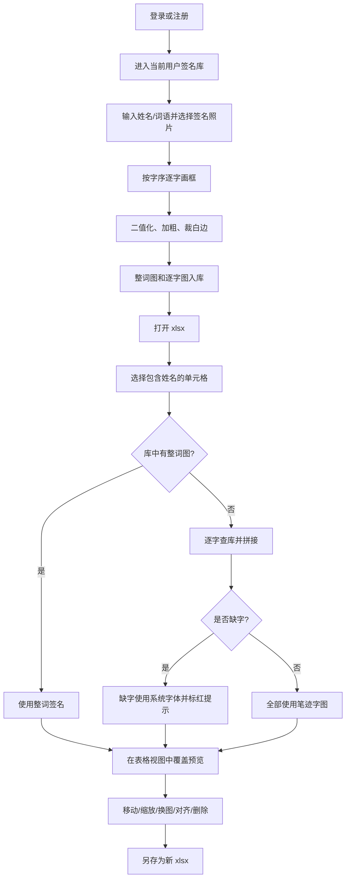

# 业务逻辑

> 最后更新：2026-07-20

## 产品目标

这是一个离线 macOS 桌面工具，用于把手写签名照片整理为可复用的签名库，并把 Excel 表格指定单元格中的姓名替换为签名图片。项目现有材料把车间巡查记录表列为主要使用场景。

## 主流程

## 1. 用户与会话

- 应用不创建默认账号；首次使用者必须在登录页自行注册。
- 新用户提供账号、可选昵称和密码；昵称为空时使用账号。
- 登录成功后，主进程只持有一个 `currentUser`、对应 `LibraryStore` 和至多一个已打开 `XlsxDoc`。
- 切换/退出用户会递增会话代际并清空当前签名库引用和 xlsx 内存状态；仍在等待文件对话框或图像处理的旧请求会被拒绝。
- 账号匹配忽略大小写，密码通过加盐 scrypt 校验。

## 2. 签名入库

1. 用户输入签名对应的词，再选择 PNG/JPG/JPEG/WebP/BMP 图片；图片最大 25 MB、最多 8000 万像素。
2. 渲染进程按字符顺序收集矩形框，框数量必须等于词的字符数。
3. 主进程逐框裁图：灰度化 → 阈值 180 二值化 → 1 次笔画膨胀 → 裁去白边。
4. 所有框的并集作为整词区域，经过同样处理。
5. `LibraryStore` 使用随机 UUID 文件名写入一张整词 PNG 和每字一张 PNG，并更新 JSON 索引；所有文件路径均限制在当前账号目录内。
6. 同字/同词可有多张图片；首张自动成为默认图，用户之后可设默认或删图。

直接补录单字时要求恰好一个汉字，图片同样会二值化和裁白边，但不会生成整词条目。

## 3. 签名库检索与管理

- UI 分“单字”和“整词”两个列表。
- 搜索字段：原字/词、拼音全拼、拼音首字母、来源词。
- 排序：拼音、最新入库时间、条目张数。
- 过滤：全部、仅多图、仅单图。
- 删除条目会同步删除 PNG；若默认图被删，剩余第一张升为默认。

## 4. xlsx 打开与编辑

- 只读取 workbook 的第一个 worksheet。
- 输入 xlsx 最大 50 MB，内部条目不超过 5000 个，声明解压体积不超过 250 MB；首工作表还受 10000 行、256 列和 200000 格上限保护。
- 网格提取文本、行高、列宽、合并单元格、字体、填充、对齐、边框和已有嵌入图。
- 单元格双击后可编辑，失焦时把新值写入内存 workbook。
- 已放置签名的格必须先删除签名，才能恢复文字编辑。
- UI 缩放只改变视觉 transform，不改变内部 Excel 像素坐标。

## 5. 合成策略

| 模式 | 条件 | 行为 |
|---|---|---|
| `word` | 库中有完全相同的整词 | 直接使用整词图 |
| `chars` | 无整词，但每个字都有单字图 | 单字统一到 200 px 高，相邻重叠 10%，multiply 拼接 |
| `partial` | 至少一个字无笔迹图 | 缺字用系统字体渲染，其余用库中笔迹，并在 UI 报告缺字 |

自动布局在目标单元格或合并区内等比缩放到 96%，居中且不越界。换图或重生成会重置为自动布局。人工移动和拖角会被限制在目标区域内；人工拖角允许改变宽高比。

## 6. 导出

- 合成期间签名项只存在于 `XlsxDoc.items` 和渲染叠加层，不产生输出文件。
- 导出时从当前内存 workbook 创建快照副本，再在副本中清空目标格文字并写入 PNG；用户编辑会保留，连续导出不会重复累加签名图。
- 原 worksheet 中已有图片由 exceljs 写回保留。
- 保存对话框默认建议 `原名_已合成.xlsx`。
- 如果用户选择的输出路径等于源路径，主进程拒绝写入。

## 明确不在当前范围

根据项目计划：不做自动手写识别、连笔生成、重型 Excel 排版编辑器、Python 运行时、网络上传或遥测。Windows/移动端打包也不属于当前已实现范围。
