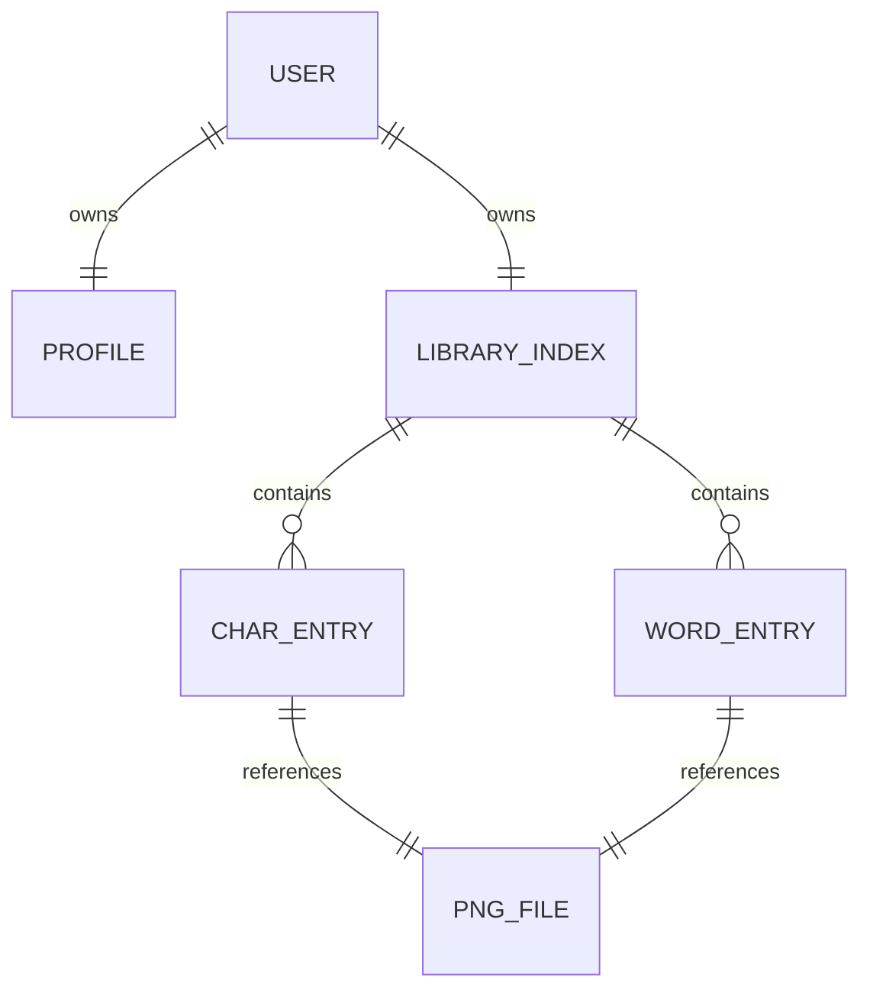

# 本地数据结构

> 最后更新：2026-07-20

项目不使用关系型数据库或 ORM。持久化由普通目录、JSON 索引和 PNG 文件组成；xlsx 是用户选择的外部输入/输出文件。

## 数据根目录

主进程通过以下表达式确定数据位置：

```js
path.join(app.getPath('userData'), 'userData')
```

实际绝对路径由 Electron 和操作系统决定。每个用户使用独立目录：

```text
<Electron userData>/userData/
└── users/
    └── <8位十六进制用户id>/
        ├── profile.json
        ├── library.json
        ├── chars/
        │   └── char_<UUID>.png
        └── words/
            └── word_<UUID>.png
```

## `profile.json`

```json
{
  "id": "8位十六进制字符串",
  "account": "登录账号",
  "name": "显示名称",
  "salt": "随机16字节的十六进制字符串",
  "passwordHash": "scrypt派生值（十六进制）",
  "createdAt": 0
}
```

- ID 来自 `crypto.randomBytes(4)`。
- salt 来自 `crypto.randomBytes(16)`。
- 密码使用 `crypto.scryptSync(password, salt, 64)`；不以明文落盘。
- 新注册密码长度限制为 8 至 128 个字符，账号最长 64 个字符。
- 登录比较使用 `crypto.timingSafeEqual`。
- 公开到 UI 的 profile 会移除 salt 和 passwordHash。
- account 唯一性按忽略大小写检查。

## `library.json`

```json
{
  "chars": {
    "甲": [
      {
        "id": "char_<UUID>",
        "file": "chars/char_<UUID>.png",
        "sourceWord": "甲乙丙",
        "isDefault": true,
        "createdAt": "ISO-8601 时间"
      }
    ]
  },
  "words": {
    "甲乙丙": [
      {
        "id": "word_<UUID>",
        "file": "words/word_<UUID>.png",
        "isDefault": true,
        "createdAt": "ISO-8601 时间"
      }
    ]
  }
}
```

- 单字与整词都允许保存多个条目。
- 默认读取显式 `isDefault` 条目；没有标记时回退到数组第一项。
- 删除默认条目后，剩余第一项会被提升为默认。
- 删除条目同时删除它引用的 PNG；最后一项删除后移除该 key。
- 直接补录单字时 `sourceWord` 为 `(单字补录)`。
- 新条目的 ID 和文件名使用 `crypto.randomUUID()`，不包含用户输入的姓名或词语。
- 索引中的相对文件路径在读取、写入和删除前都会解析并验证，越出当前用户目录时拒绝操作。

## 关系与生命周期



登录时主进程为当前用户创建 `LibraryStore`；退出登录会清除当前库和已打开 xlsx 的内存状态。xlsx 工作区的签名项在导出前仅驻留内存，不写入用户库或源表格。

## 备份与恢复

备份一个用户时，应完整复制其用户目录，保证 JSON 与 PNG 的相对路径一起保留。自测已验证复制后的目录可被 `LibraryStore` 读取。

当前没有内置备份、恢复、迁移或 JSON schema 版本号。修改索引结构时必须兼容旧条目（例如当前代码允许旧条目缺少 `createdAt`）。

## 安全注意事项

- 应用不创建固定默认账号或默认密码；首次使用需自行注册。
- 本地数据目录没有应用层加密，能读取操作系统账户文件的人可以读取签名 PNG 和 JSON。
- 签名 PNG 使用随机 UUID 文件名，姓名/词语只保存在 `library.json` 的索引 key 或来源字段中。
