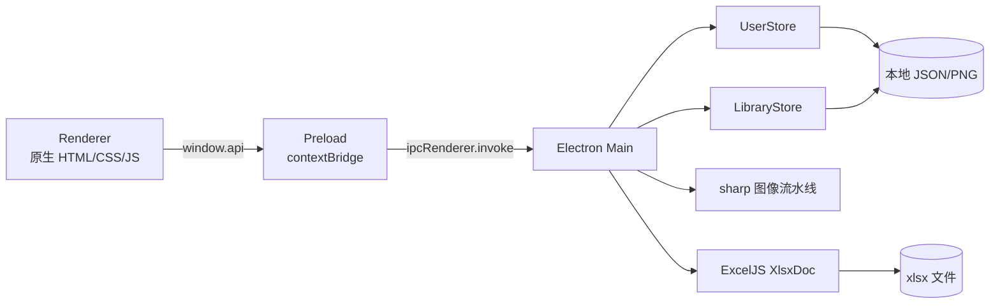

# 技术栈

> 最后更新：2026-07-20

## 运行架构

| 层 | 技术 | 锁定版本 | 用途 |
|---|---|---:|---|
| 桌面运行时 | Electron | 43.1.1 | 窗口、文件对话框、主/渲染进程 IPC |
| UI | HTML / CSS / CommonJS JavaScript | 项目源码 | 登录、签名库和 xlsx 工作区；未使用前端框架 |
| xlsx | exceljs | 4.4.0 | 读取样式/合并区/图片，修改单元格并插入签名图 |
| xlsx 预检 | jszip | 3.10.1 | 解析中央目录并限制条目数与声明解压体积 |
| 图像处理 | sharp | 0.35.3 | 灰度、二值化、裁剪、缩放、拼接与 PNG 输出 |
| 拼音 | pinyin-pro | 3.28.1 | 离线生成全拼与首字母，供签名库搜索 |
| 间接 ID 生成 | uuid | 11.1.1（override） | ExcelJS 条件格式内部使用；覆盖旧版以规避已知缓冲区边界公告 |
| 存储 | Node.js `fs` + JSON + PNG | 内置模块 | 用户资料和签名库的透明文件存储 |
| 密码派生 | Node.js `crypto.scryptSync` | 内置模块 | 加盐密码哈希与恒定时间比较 |

版本来自 `sign-compose-app/package-lock.json`。项目使用 lockfile v3，安装命令应优先采用 `npm ci`。

`package.json` 通过 `overrides.uuid` 将 ExcelJS 的间接依赖约束到 `^11.1.1`。完整 xlsx 自测已验证 ExcelJS 4.4.0 与该版本兼容，`npm audit --omit=dev` 报告 0 个已知漏洞。

## 进程边界

- `BrowserWindow` 启用 `contextIsolation: true` 与 sandbox，关闭 `nodeIntegration`，拒绝外部导航和新窗口。
- 渲染进程只能通过 `src/preload.js` 暴露的白名单调用主进程。
- HTML 设置 CSP：默认仅加载自身资源，图片额外允许 `data:`，内联样式被允许。

## 关键实现参数

| 参数 | 值 | 来源 |
|---|---:|---|
| 图像二值化阈值 | 180 | `src/main/image.js` |
| 笔画膨胀次数 | 1 | `src/main/image.js` |
| 单字拼接目标高度 | 200 px | `src/main/image.js` |
| 相邻字重叠比例 | 10% | `src/main/image.js` |
| 签名自动填充比例 | 96% | `src/main/xlsx.js` |
| Excel 像素到 EMU | 1 px = 9525 EMU | `src/main/xlsx.js` |
| 主窗口初始尺寸 | 1280 × 840 | `src/main/index.js` |

## 已确认的选型理由

- Electron 满足 macOS 桌面应用形态，并将文件访问留在主进程。
- 原生前端与当前三视图规模匹配，项目没有构建步骤。
- sharp 和 exceljs 让全部处理留在 Node.js 生态，不引入 Python 运行时。
- JSON + PNG 目录可直接复制备份，符合项目明确的数据可迁移约束。
- pinyin-pro 离线运行，不需要把签名或姓名上传到网络。

> ⏳ 待补充：确定 Node.js、npm 与 macOS 的正式支持矩阵；项目目前未声明 `engines`。
